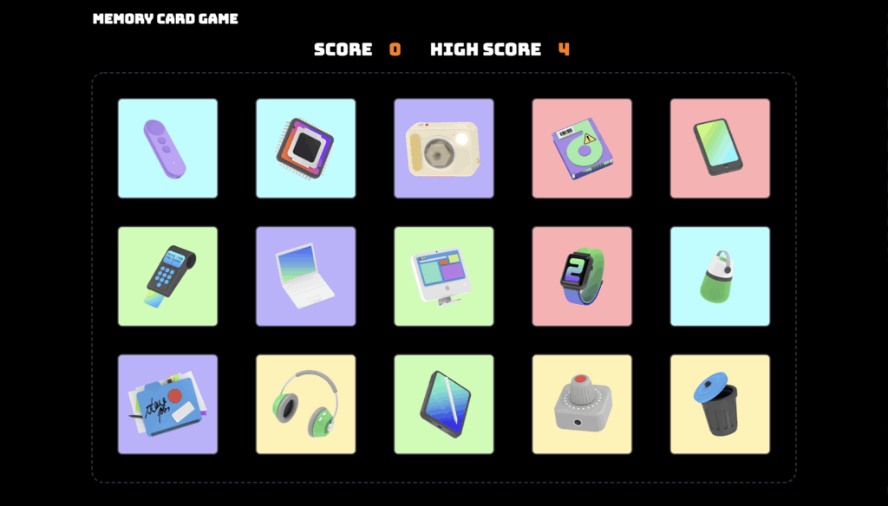

# Memory Card

### This is a game that puts your memory to the test. 

## Live Demo

[Visit the site](https://currytay.github.io/memory-card/)

**Note:** This website is best viewed on high res screens (1080p and up). Check the [improvements section](#improvements) for future updates.

**Gameplay demo ↓**

## Project Details

### Prompt

From The Odin Project's [curriculum](https://www.theodinproject.com/courses/javascript/lessons/memory-card). 

### Built With

- ReactJS (bootstrapped with [Create React App](https://github.com/facebook/create-react-app))
- HTML5
- CSS3

## Improvements

Future features / opportunities for improvement:

- Make website responsive
- Use the [ReactTransitionGroup](https://reactjs.org/docs/animation.html) component for entering and exiting transitions

## Acknowledgements

Illustrations from [Storytale Freebies](https://storytale.io/freebies/) package. [Falling emojis](https://github.com/DucktorDanny/FallingEmojis) component by [DucktorDanny](https://github.com/DucktorDanny).